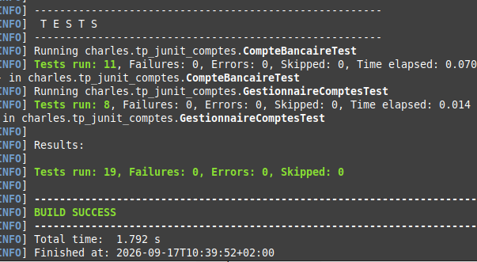

# BTS SIO - TP Tests unitaires avec JUnit

## Gestion de comptes bancaires

## Présentation

L'objectif de ce TP est de mettre en pratique les tests unitaires avec JUnit et l'utilisation de Git + GitHub.

Le projet permet de gérer des comptes bancaires et de tester différentes situations : les cas normaux, les cas limites et les cas d'erreur.

## Choix de conception

### Classe CompteBancaire

La classe CompteBancaire permet de représenter un compte bancaire.

Elle contient différentes infos :

-  iban: identifiant du compte bancaire.
-  titulaire : nom du titulaire du compte.
-  solde : montant disponible sur le compte.
-  decouvertAutorise : montant maximum du découvert autorisé.

La classe contient également des méthodes permettant de déposer ou retirer de l'argent, de calculer les intérêts et de vérifier si le compte est à découvertou non

L'IBAN est déclaré final car il ne doit pas être modifié après la création du compte.

### Classe GestionnaireComptes

La classe GestionnaireComptes permet de gérer plusieurs comptes bancaires.

Elle permet :

- d'ajouter un compte 
- de rechercher un compte avec son IBAN 
- d'effectuer un virement entre deux comptes
- de calculer le solde total
- de trouver les comptes qui sont à decouvert

Les comptes sont stockés dans une liste

### Gestion des exceptions

J'ai créé plusieurs exceptions personnalisées qui héritent de RuntimeException

- MontantInvalideException : utilisée lorsqu'un dépôt ou un retrait est inférieur ou égal à zéro.
- SoldeInsuffisantException : utilisée lorsqu'un retrait dépasse le découvert autorisé.
- CompteDejaExistantException : utilisée lorsqu'un compte avec le même IBAN existe déjà.
- CompteInconnuException : utilisée lorsqu'un IBAN recherché n'existe pas.

### Choix concernant les tests

J'ai choisi de développer le code d'abord puis de réaliser les tests unitaires.
Je n'ai donc pas utilisé une méthode TDD

Après avoir développé les classes, j'ai créé les tests avec JUnit  afin de vérifier le fonctionnement du programme dans les cas normaux, les cas limites et les cas d'erreur.

## Lancer les tests

Le projet utilise Maven pour gérer les dépendances et lancer les tests JUnit 5.

Pour lancer les tests, il faut ouvrir un terminal ,se rendre dans le dossier du projet et lancer la commande
 :

mvn test

une fois la commande lancée, si tous les tests sont bons, ceci apparait : 

## Récapitulatif des tests

### CompteBancaireTest

La classe `CompteBancaireTest` contient 11 tests.

| Test | Description |
|---|---|
| `testDepot` | Vérifie qu'un dépôt de 500 € sur un compte ayant 1000 € augmente correctement le solde à 1500 €. |
| `testRetrait` | Vérifie qu'un retrait de 300 € sur un compte ayant 1000 € diminue correctement le solde à 700 €. |
| `testCalculerInterets` | Vérifie que les intérêts sont correctement calculés avec un solde de 1000 € et un taux de 5 %, soit 50 €, et que le solde reste à 1000 €. |
| `testEstEnDecouvert` | Vérifie que la méthode `estEnDecouvert()` retourne `true` lorsque le solde est négatif. |
| `testInformationsCompte` | Vérifie que les méthodes `getSolde()`, `getTitulaire()` et `getIban()` retournent les bonnes informations. |
| `testDepotMontantNul` | Vérifie qu'un dépôt de 0 € provoque une `MontantInvalideException`. |
| `testDepotMontantNegatif` | Vérifie qu'un dépôt de -100 € provoque une `MontantInvalideException`. |
| `testRetraitMontantNul` | Vérifie qu'un retrait de 0 € provoque une `MontantInvalideException`. |
| `testRetraitMontantNegatif` | Vérifie qu'un retrait de -100 € provoque une `MontantInvalideException`. |
| `testRetraitJusquAuDecouvertAutorise` | Vérifie qu'un retrait permettant d'atteindre exactement -200 €, avec un découvert autorisé de 200 €, est accepté. |
| `testRetraitDepasseDecouvertAutorise` | Vérifie qu'un retrait dépassant le découvert autorisé provoque une `SoldeInsuffisantException`. |

**Nombre total de tests : 11**

### GestionnaireComptesTest

La classe `GestionnaireComptesTest` contient 8 tests.

| Test | Description |
|---|---|
| `ajouter` | Vérifie qu'un compte peut être ajouté au gestionnaire et qu'il peut ensuite être retrouvé avec son IBAN. |
| `doublon` | Vérifie qu'il est impossible d'ajouter deux comptes possédant le même IBAN et qu'une `CompteDejaExistantException` est levée. |
| `rechercher` | Vérifie que la recherche d'un compte existant retourne bien le compte ajouté. |
| `inconnu` | Vérifie que la recherche d'un IBAN inexistant provoque une `CompteInconnuException`. |
| `virement` | Vérifie qu'un virement de 200 € fonctionne correctement : le compte source passe de 1000 € à 800 € et le compte destination de 500 € à 700 €. |
| `virementEchec` | Vérifie qu'un virement échoue lorsque le compte source ne possède pas suffisamment de fonds et que les deux soldes restent inchangés. |
| `total` | Vérifie que `soldeTotal()` additionne correctement les soldes des différents comptes, ici 1000 € + 500 € = 1500 €. |
| `decouvert` | Vérifie que `listeComptesEnDecouvert()` retourne uniquement les comptes dont le solde est négatif. |

**Nombre total de tests : 8**

### Bilan des tests

| Classe | Nombre de tests |
|---|---:|
| `CompteBancaireTest` | 11 |
| `GestionnaireComptesTest` | 8 |
| **Total** | **19** |

## Difficultés rencontrées

### 1. Création de l'arborescence du projet

Au début du TP, j'ai créé une partie de l'arborescence du projet directement depuis le terminal.

Cela a créé quelques problèmes lorsque j'ai ensuite ouvert le projet avec Eclipse, notamment pour que les différents dossiers et fichiers soient correctement reconnus comme un projet Java

J'ai dû vérifier et réorganiser l'arborescence afin d'avoir correctement les dossiers src/main/java et src/test/java.

### 2. Configuration de JUnit dans le fichier pom.xml

J'ai également rencontré des problèmes avec la configuration de JUnit dans le fichier pom.xml

La version de JUnit qui était configurée au départ n'était pas adaptée à mon projet, ce qui empêchait certains tests de fonctionner correctement dans Eclipse

J'ai donc dû modifier le fichier pom.xml afin d'utiliser une version compatible de JUnit 5 

### 3. Configuration du projet dans Eclipse

Au début, j'ai également eu des difficultés pour faire fonctionner correctement le projet dans Eclipse.

Entre l'arborescence créée avec le terminal et la configuration Maven, certains éléments n'étaient pas immédiatement reconnus correctement

## Bilan de ce que j'ai appris 

Ce TP m'a permis de mieux comprendre l'utilité des tests unitaires avec JUnit
Les tests permettent notamment de :

    Vérifier que ton code fonctionne 

    Détecter les bugs rapidement 

    Tester les cas normaux 

    Tester les cas limites 

    Vérifier que les erreurs provoquent les bonnes exceptions 

    Éviter de devoir vérifier manuellement chaque fonctionnalité après une modification du code.

Les tests m'ont permis de vérifier que les méthodes de mes classes fonctionnent correctement et que les erreurs sont bien gérées.

J'ai aussi appris à mieux utiliser Maven pour gérer les dépendances et exécuter les tests avec la commande `mvn test`.

Enfin, ce TP m'a permis de mettre en pratique Git en réalisant plusieurs commits au fur et à mesure de l'avancement du projet --> versionning

